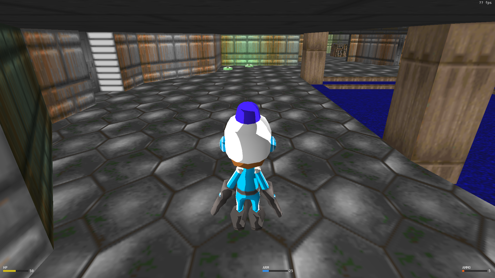
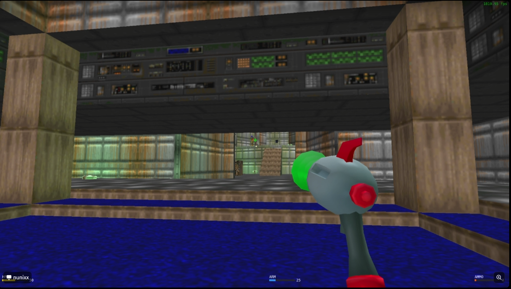

# Doom E1M1 — 3D Version

**Disciplina:** Computação Gráfica e Visualização I (INF01047) — INF/UFRGS  
**Autores:** Caio Felipe Ferreira Nunes, João Kenji Suwa

Jogo 3D em C++/OpenGL que recria parte da primeira fase (*E1M1*) de [Doom (1993)](https://pt.wikipedia.org/wiki/Doom_(jogo_eletrônico_de_1993), desenvolvido como trabalho final da disciplina de Compuração Gráfica e Visualização. 

## Third Person



## First Person



---
## Contribuições
`Caio Felipe Ferreira Nunes`
- Camera FirstPerson e ThirdPerson(LookAt);
- Renderização de objetos;
- Refatoração do Código;
- Mapeamento de objetos dentro do mapa;
- Logica de Colisão;
- HitBoxes;
- Animações dos Personagens(Player e Enemy);
- HUD do Player;
- Interseção com objetos;
- Curva de Bézier no Patrol do Enemy;

`João Kenji Suwa`
- Renderização de Texturas;
- Renderização de objetos;
- Camera ThirdPerson(LookAt);
- Movimenção do Player e Gravidade;
- Implementação de Colisão;
- Colisão de tiros;
- Iluminação;
- Animação dos Objetos(HealthPack e Armor);

---
## Uso de IA

Durante o desenvolvimento do trabalho, foram utilizadas ferramentas de inteligência artificial tanto remotas quanto locais, incluindo Claude, ChatGPT (GPT), Gemini e ferramentas integradas ao terminal, como OpenCode Zen. Essas ferramentas foram empregadas principalmente como apoio ao desenvolvimento, auxiliando na discussão de soluções, refatoração de código, esclarecimento de conceitos, investigação de erros e tomada de decisões de projeto — por exemplo, na escolha e implementação do sistema de animação e em ajustes na organização da aplicação.

De forma geral, a dupla considera que o uso dessas ferramentas contribuiu significativamente para acelerar o desenvolvimento e facilitar a exploração de alternativas técnicas. Entretanto, as sugestões fornecidas nem sempre eram diretamente aplicáveis ao contexto do projeto, exigindo validação, adaptação e análise crítica antes de serem incorporadas

## Funcionalidades

| Categoria | Funcionalidades |
|-----------|----------------|
| **Renderização** | OpenGL 3.3 Core Profile, shaders GLSL próprios (Phong + point lights + texturas) |
| **Câmeras** | Dois modos: LookAt (órbita em 3ª pessoa) e FirstPerson (FPS com free look) |
| **Modelos 3D** | Carregamento de arquivos `.obj` via `tinyobjloader`, registro centralizado via CSV |
| **Texturas** | Mapeamento de texturas em todos os objetos com fallback para cores sólidas estilo Doom |
| **Iluminação** | 2 luzes direcionais + até 16 luzes pontuais dinâmicas (itens brilham com cores próprias) |
| **Colisão** | Grid espacial 2D (XZ) + malha de triângulos para colisão jogador×mapa; AABB raycast para tiros |
| **Inimigos** | IA com 4 estados (Idle / Patrol via curva Bézier cúbica / Chase / Dead), dano por contato |
| **Animação** | Sistema de animação por partes (torso, cabeça, braços, pernas) com rotação em pivôs locais |
| **Itens** | Health packs (cura), armaduras, armas (pistola, shotgun) — todos com rotação animada e emissão de luz |
| **HUD** | Barra de vida, barra de armadura, munição, crosshair, indicador facial, flash de dano, alerta de HP baixo |
| **Tiro** | Raycast com hitbox AABB, laser visual, cooldown entre disparos |
| **Debug** | Hitboxes wireframe coloridas por tipo (F1 para toggle) |
| **Shader hot-reload** | Tecla `R` recarrega shaders em tempo real |

---

## Arquitetura de Diretórios

```
├── include/                  # Headers auxiliares (matrizes, utils, stb_image, tiny_obj_loader)
├── src/
│   ├── main.cpp              # Loop principal, carregamento de shaders, cena
│   ├── constants.h           # Constantes globais (câmera, jogador, física)
│   ├── textrendering.cpp     # Renderização de texto (FPS, HUD)
│   ├── correcao.cpp          # Suporte à correção automatizada
│   ├── stb_image.cpp         # Carregamento de imagens
│   ├── tiny_obj_loader.cpp   # Carregamento de modelos OBJ
│   ├── glad.c                # OpenGL loader (GLAD)
│   ├── shader_vertex.glsl    # Vertex shader (transformações, normais, UVs)
│   ├── shader_fragment.glsl  # Fragment shader (Phong + point lights + texturas)
│   ├── modelRendering/       # Construção de assets 3D e renderização de modelos
│   ├── textureRendering/     # Carregamento e binding de texturas
│   ├── collision/            # Malha de colisão, grid espacial, raycast
│   ├── classes/
│   │   ├── game_object.h/cpp          # Classe base abstrata
│   │   ├── player/player.h/cpp        # Jogador (movimento, câmera, tiro, stats)
│   │   ├── enemy/enemy.h/cpp          # Inimigo (IA, Bézier, perseguição)
│   │   └── objects/                   # Objetos do mundo
│   │       ├── world_object.h/cpp     # Base para itens (rotação, interação)
│   │       ├── health_pack.h/cpp      # Cura
│   │       ├── gun.h/cpp              # Pistola e shotgun
│   │       └── armor.h/cpp            # Armadura
│   ├── animation/animator.h/cpp       # Animação esquelética por partes
│   ├── hitbox/hitbox_renderer.h/cpp   # Hitboxes de debug (wireframe)
│   ├── laser/laser.h/cpp              # Laser visual do tiro
│   └── hud/hud.h/cpp                  # HUD (barras, crosshair, face)
├── data/
│   ├── paths.csv              # Registro de modelos (nome → .obj → textura)
│   ├── Soldier/               # Modelo do jogador
│   ├── Enemy/                 # Modelo do inimigo
│   ├── Map/                   # Fase Doom E1M1
│   ├── Healthpack/            # Health pack
│   ├── Armor/                 # Armadura
│   ├── Pistol/                # Pistola
│   └── Shotgun/               # Espingarda
├── images/                    # Screenshots de referência
├── lib-*/                     # GLFW pré-compilado (mingw-32, mingw-64, ucrt-64, vc2022, linux)
├── bin/                       # Executável compilado
├── CMakeLists.txt             # Build system CMake
├── CMakePresets.json          # Preset CMake para MSYS2 UCRT64
├── Makefile                   # Build alternativo (Linux)
├── Makefile.macOS             # Build alternativo (macOS)
└── COMPILACAO.md              # Instruções detalhadas de compilação
```

---

## Tecnologias

| Tecnologia | Versão | Uso |
|------------|--------|-----|
| C++ | C++14 | Linguagem principal |
| OpenGL | 3.3 Core Profile | Renderização 3D |
| GLFW | 3.x | Janela, input, contexto OpenGL |
| GLAD | — | Carregamento de funções OpenGL |
| GLM | — | Matemática (matrizes, vetores) |
| tinyobjloader | — | Carregamento de modelos `.obj` |
| stb_image | — | Carregamento de texturas |
| CMake | ≥ 3.10 | Build system |

---

## Compilação e Execução

### Linux

```bash
# Instalar dependências (Ubuntu)
sudo apt-get install build-essential make libx11-dev libxrandr-dev \
                     libxinerama-dev libxcursor-dev libxcb1-dev libxext-dev \
                     libxrender-dev libxfixes-dev libxau-dev libxdmcp-dev

# Compilar e executar com CMake
cmake --workflow --preset configure-build-run

# Ou manualmente:
cmake -B build -S .
cmake --build build
./bin/Linux/main
```

### Windows (MSYS2 UCRT64)

```bash
# Compilar com CMake
cmake --preset "GCC 15.2.0 x86_64-w64-mingw32 (ucrt64)"
cmake --build --preset default-build

# O executável estará em bin/Debug/main.exe
```

### Windows (VSCode)

1. Instale as extensões **ms-vscode.cpptools** e **ms-vscode.cmake-tools**
2. Configure o compilador MinGW/GCC
3. Clique em "Play" na barra inferior

### macOS

```bash
# Instalar GLFW via Homebrew
brew install glfw

# Compilar com Makefile
make -f Makefile.macOS
make -f Makefile.macOS run
```

> [!TIP]
> Instruções detalhadas, incluindo solução de problemas, estão em [`COMPILACAO.md`](COMPILACAO.md).

---

## Manual da Aplicação

| Tecla | Ação |
|-------|------|
| `W` `A` `S` `D` | Movimentar (LookAt) / Voar (FirstPerson) |
| Mouse (arrastar) | Rotacionar câmera / Olhar ao redor |
| Clique esquerdo | Atirar (FirstPerson) / Arrastar Camera(LookAt) |
| Scroll | Zoom in/out (LookAt) |
| `;` (ponto e vírgula) | Alternar modo de câmera |
| `F1` | Mostrar/esconder hitboxes de debug |
| `R` | Recarregar shaders em tempo real |
| `H` | Mostrar/esconder informações na tela |
| `Esc` | Sair |

---

## Próximos Passos (Sugestões)

- **Implementar tela de título e game over** — atualmente o jogo inicia direto na fase e fecha ao morrer
- **Adicionar áudio** — não há música ambiente ou efeitos sonoros
- **Implementar hotbar visual** — armas coletadas não são exibidas na tela (apenas stats em texto)
- **Implementar pickup de armas no chão** — as armas estão definidas mas não são geradas na fase
- **Adicionar ataque à distância para inimigos** — atualmente causam dano apenas por contato
- **Expandir para mais fases** — suportar seleção e loading de múltiplos mapas
